# รายงาน Smoke Test — OLS Web Dev
**วันที่ทดสอบ:** 25 มิถุนายน 2569  
**Target URL:** https://ols-web-dev.ndlp.go.th/  
**ผู้ทดสอบ:** Claude Code (automated)  
**ประเภทการทดสอบ:** Smoke Test  
**สรุปผล:** ✅ ผ่าน 6/8 รายการ | ❌ พบปัญหา 2 รายการ  
**แผนงาน:** [plan-smoke-test.md](plan-smoke-test.md)

---

## ตารางสรุปผลการทดสอบ

| No. | Role | Topic | Result | Severity |
|-----|------|-------|--------|----------|
| 1 | Creator | [เข้าสู่ระบบและโหลดหน้าแรก](#tc1) | ✅ ผ่าน | - |
| 2 | Creator | [เมนูหลักและ Navigation](#tc2) | ✅ ผ่าน | - |
| 3 | Creator | [หน้าสร้าง / จัดการสื่อและคอร์ส](#tc3) | ⚠️ ผ่าน (มีข้อสังเกต) | Low |
| 4 | Creator | [หน้าตั้งค่าช่องของฉัน](#tc4) | ✅ ผ่าน | - |
| 5 | Learner | [เข้าสู่ระบบและโหลดหน้าแรก (Trending)](#tc5) | ❌ ไม่ผ่าน | **High** |
| 6 | Learner | [เมนูหลักและ Navigation](#tc6) | ✅ ผ่าน | - |
| 7 | Learner | [เรียกดูรายการคอร์สและสื่อ (คลังสื่อ)](#tc7) | ✅ ผ่าน | - |
| 8 | Learner | [เข้าเนื้อหาสื่อการเรียนรู้](#tc8) | ✅ ผ่าน | - |

---

## รายละเอียดการทดสอบแต่ละ TC

<a id="tc1"></a>

### TC1 — Creator: เข้าสู่ระบบและโหลดหน้าแรก ✅

**วิธี Login (console JS):**
```javascript
await fetch("https://ols-api-dev.ndlp.go.th/api/auth/link/ndlp", {
  method: "PUT", credentials: "include",
  headers: { "content-type": "application/json" },
  body: JSON.stringify({ accessToken: "mock-ndlp-creator-token" })
});
```

**ผลลัพธ์:** API ตอบกลับ 200 พร้อม user session  
```json
{ "user": { "name": "NDLP Creator", "email": "ndlp.creator@ols.local" } }
```
Session คงอยู่หลัง reload ✓ เข้าถึง `/creator` ได้ทันที

**ข้อสังเกต:** หน้าแรก `/` ยังแสดง landing page สาธารณะหลัง login — ไม่มี auto-redirect ไป `/creator`

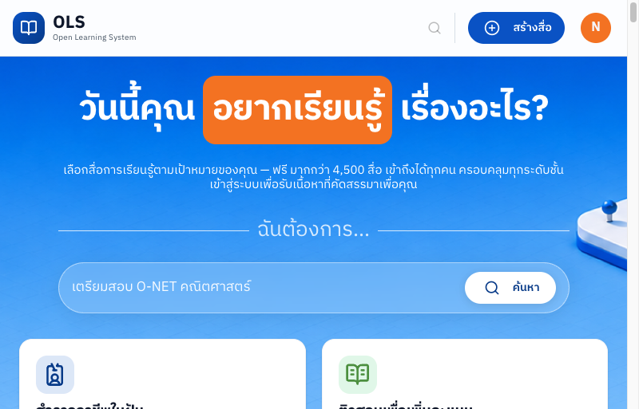

---

<a id="tc2"></a>

### TC2 — Creator: เมนูหลักและ Navigation ✅

**หน้าที่ทดสอบ:** `/creator` → `/creator/course` → `/creator/learning-path` → `/creator/settings`

**เมนูที่พบ:**
- Topbar: หน้าหลัก | เส้นทางการเรียน | คลังสื่อทั้งหมด
- Sidebar (Creator): จัดการสื่อการเรียนรู้ | จัดการคอร์สเรียน | จัดการเส้นทางการเรียน | ตั้งค่าช่องของฉัน | เปลี่ยนเป็น Learner mode

**ผลลัพธ์:** เมนูครบถ้วน navigate ได้ทุกหน้า ไม่พบ 404 หรือ error ✓

---

<a id="tc3"></a>

### TC3 — Creator: หน้าสร้าง/จัดการสื่อและคอร์ส ⚠️

**หน้าที่ทดสอบ:** `/creator/media` และ `/creator/course`

| หน้า | ผล | รายละเอียด |
|------|-----|-----------|
| `/creator/media` | ✅ | แสดง 5 รายการ: ไฟล์เรียน, PDF 1, Video AI 101, Test, Media 1 |
| `/creator/course` | ✅ | แสดง 5 คอร์ส: คอร์สอนาคตแพทย์, คอร์สอนาคตการทูต, คอร์สพัฒนาด้านภาษา, Course 2, My Course |

**ปัญหา (Low):** Thumbnail ทุกรายการแสดงเป็น placeholder icon เทา — รูปจริงไม่โหลด

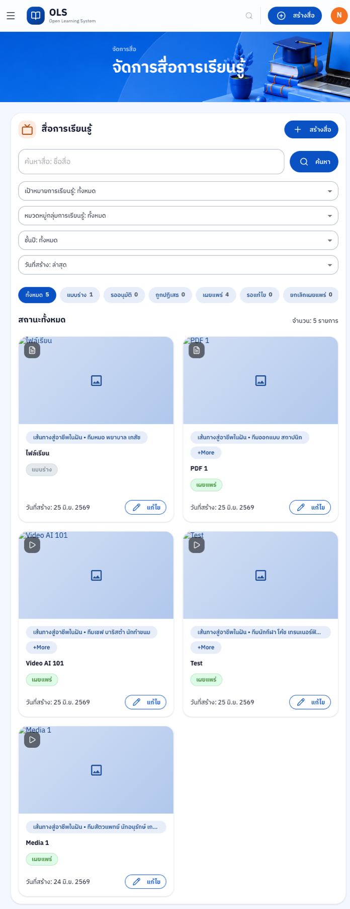
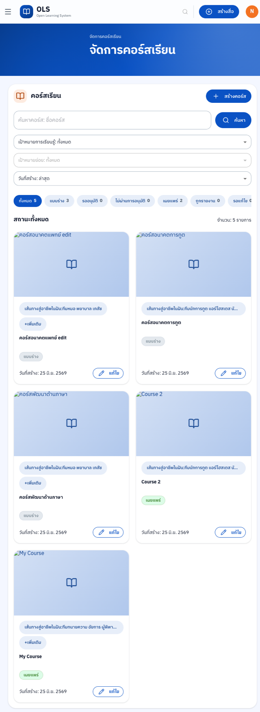

---

<a id="tc4"></a>

### TC4 — Creator: หน้าตั้งค่าช่องของฉัน ✅

**หน้าที่ทดสอบ:** `/creator/settings`

**ผลลัพธ์:** หน้า "ตั้งค่าช่องของฉัน" โหลดสำเร็จ แสดง section ยืนยัน YouTube Channel ✓

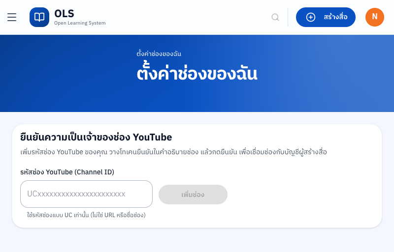

---

<a id="tc5"></a>

### TC5 — Learner: เข้าสู่ระบบและโหลดหน้าแรก ❌

**วิธี Login (console JS):**
```javascript
await fetch("https://ols-api-dev.ndlp.go.th/api/auth/link/ndlp", {
  method: "PUT", credentials: "include",
  headers: { "content-type": "application/json" },
  body: JSON.stringify({ accessToken: "mock-ndlp-learner-token" })
});
```

**ผลลัพธ์ Login API:** ✅ สำเร็จ — user `NDLP Learner` (session active)

**ผลลัพธ์ หน้า `/trending`:** ❌ ERROR — error banner:
> **"ไม่สามารถโหลดข้อมูลได้: Cannot GET /trending"**

Header/navbar แสดงปกติ (avatar "N" + ปุ่ม "สร้างสื่อ") แต่ main content ไม่โหลด  
ปุ่ม "ลองอีกครั้ง" กดแล้วยังเป็น error เหมือนเดิม

**สาเหตุที่เป็นไปได้:** API endpoint `GET /trending` ของ backend ไม่ response บน dev environment


---

<a id="tc6"></a>

### TC6 — Learner: เมนูหลักและ Navigation ✅

**หน้าที่ทดสอบ:** `/learning-path`, `/content`

**Sidebar Learner:**
- เป้าหมายการเรียน: สำรวจอาชีพ | ติวสอบ | 8 กลุ่มสาระ | แนะแนวทุน | ดิจิทัล/AI | ภาษา
- สื่อการเรียนรู้: เส้นทางการเรียน | คลังสื่อ | ไลฟ์สด
- ของฉัน: การเรียนของฉัน | การติดตาม | โปรไฟล์
- เปลี่ยนเป็น Creator mode

**ผลลัพธ์:** navigate ได้ทุกหน้า ไม่พบ error ✓

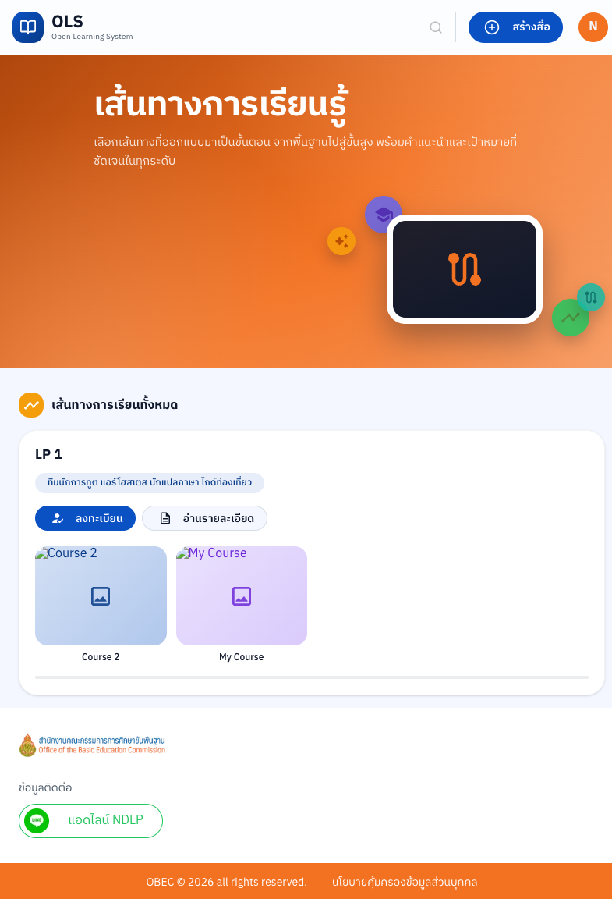

---

<a id="tc7"></a>

### TC7 — Learner: เรียกดูรายการคอร์สและสื่อ ✅

**หน้าที่ทดสอบ:** `/content`

**ผลลัพธ์:** "คลังสื่อทั้งหมด" โหลดสำเร็จ — **4,500 รายการ**
- สื่อการเรียนรู้: PDF, วิดีโอ, เอกสาร ✓
- คอร์ส: Course 2, My Course ✓
- เส้นทางการเรียน: LP 1 ✓
- Filter bar ครบทุก type ✓

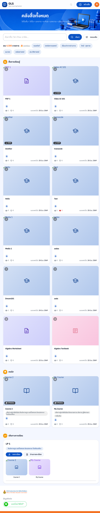

---

<a id="tc8"></a>

### TC8 — Learner: เข้าเนื้อหาสื่อการเรียนรู้ ✅

**หน้าที่ทดสอบ:** `/content/media/019efd7f-c34a-762a-a14d-188dbdde9278` (Video AI 101)

**ผลลัพธ์:**
- Video player โหลดและแสดงผล ✓
- Metadata: ชื่อสื่อ, ยอดเข้าชม, วันที่, Creator name ✓
- Tabs: ข้อมูลเพิ่มเติม | ซับไตเติ้ล | เอกสารสรุป | สื่ออื่นๆ ✓
- ความคิดเห็น + Related content ✓
- Breadcrumb ✓

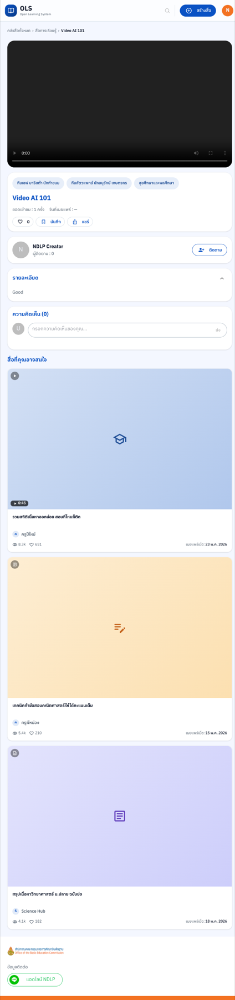

---

## สรุปปัญหาที่พบ

| # | ปัญหา | Severity | TC |
|---|-------|----------|----|
| 1 | Learner หน้าแรก `/trending` แสดง error "Cannot GET /trending" | **High** | TC5 |
| 2 | Thumbnail สื่อทุกรายการใน creator ไม่โหลด แสดง placeholder เทา | Low | TC3 |

## ข้อสังเกตเพิ่มเติม

- หน้า `/` ไม่ auto-redirect หลัง login (อาจเป็น design decision)
- Creator ยังไม่มี analytics/stats dashboard
- Learning Path มีแค่ 1 เส้นทาง (dev seed data)

---

*Smoke Test เท่านั้น — ไม่ครอบคลุม regression หรือ edge cases*  
*Screenshots: `reports/screenshots/smoke-2026-06-25/`*

---

## Deep Test — รอบ 2 (25 มิ.ย. 2569)

> **สถานะ:** ทดสอบบางส่วน — agents หยุดกลางคันจาก timeout (600s watchdog)  
> **Screenshots:** `reports/screenshots/deep-2026-06-25/`

### ✅ ผลที่ทดสอบแล้ว

#### Creator

<a id="c04"></a>

**C04 — Media Management List (`/creator/media`)**
- Result: ✅ ผ่าน
- รายการ 10 items, pagination 2 หน้า
- Filter tabs ครบ: ทั้งหมด | วิดีโอสั้น(4) | วิดีโอ(1) | รูปภาพ(0) | PDF(3) | e-Pub(0) | บทความ(0) | เพลง(0) | ไฟล์เรียน(0) | ประกาศนียบัตร/อื่นๆ(0)
- Filter dropdowns: เป้าหมายการเรียนรู้, หมวดกลุ่มสาระ, วันที่สร้าง ✓
- Search bar "ค้นหาสื่อ: ชื่อสื่อ" ✓
- "+ สร้างสื่อ" button ✓
- Edit ✏️ / Delete 🗑️ บน item card ✓
- **Bug (Low):** Thumbnail ยังเป็น placeholder เทาทุกรายการ (ยืนยันซ้ำ)
- **Bug (Medium):** Sidebar ไม่แสดงใน viewport ขนาดปัจจุบัน — เห็นแค่ hamburger icon (layout ตัด)

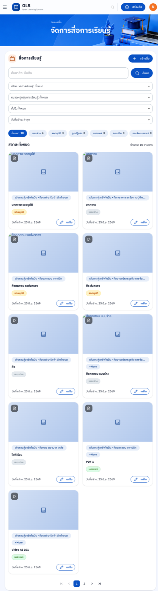


---

#### Learner

<a id="l01-deep"></a>

**L01 — Login & Session**
- Result: ✅ ผ่าน
- API ตอบกลับ 200, user "NDLP Learner" (avatar "N") ✓
- Session active หลัง navigate ✓


<a id="l02-deep"></a>

**L02 — Trending Page (ยืนยันบัก)**
- Result: ❌ ยังพบ error เหมือนเดิม
- Severity: **High**
- Error: **"ไม่สามารถโหลดข้อมูลได้: Cannot GET /trending"** — ยืนยันว่า backend ยังไม่แก้
- กด "ลองอีกครั้ง" → หน้า redirect ไป Creator media management page (ผิดปกติ — ต้องตรวจสอบเพิ่ม)


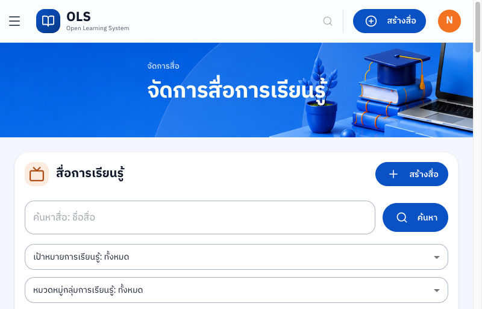

<a id="l05-deep"></a>

**L05 — Learning Path List (`/learning-path`)**
- Result: ⚠️ Partial — hero section โหลด แต่ list content ไม่ได้ scroll ลงตรวจ
- Hero banner "เส้นทางการเรียนรู้" แสดงครบ, subtitle, icon ✓

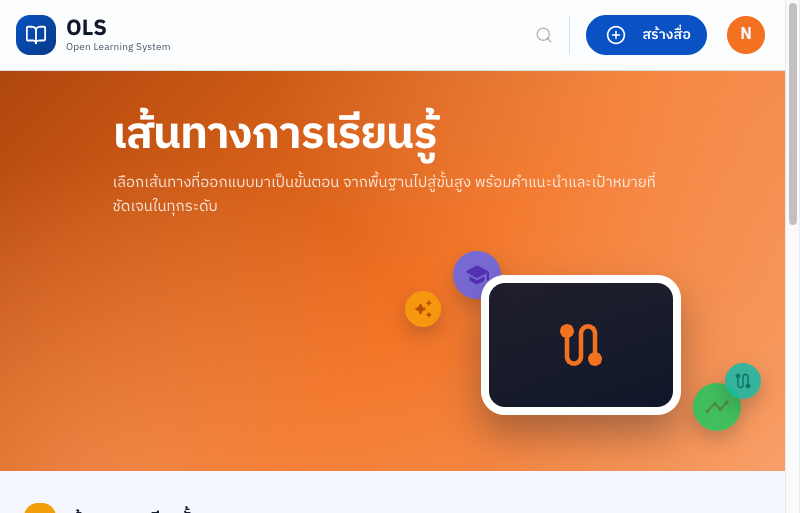

<a id="l08-deep"></a>

**L08 — Content Catalog (`/content`)**
- Result: ✅ ผ่าน
- Hero banner "คลังสื่อทั้งหมด" ✓
- Search bar: "ค้นหาสื่อ: วิชา ทักษะ อาชีพ..." + ปุ่ม "ค้นหา" + "กรองเพิ่ม" ✓
- พบ **4,500 รายการ** ✓
- Topic chips: หมดตัก, เทคนิคการแพทย์, เรื่องเล่าจากร่างกาย, วิทย์-สุขภาพ, อนาคต, คณิตศาสตร์, ประวัติศาสตร์
- 🔥 ยอดนิยม section ✓


<a id="l16-deep"></a>

**L16 — Video Content Page**
- Result: ✅ ผ่าน
- Breadcrumb: คลังสื่อทั้งหมด › สื่อการเรียนรู้ › Video AI 101 ✓
- Video player โหลด ✓
- Controls: ▶ play | 0:00 timestamp | 🔊 volume | ⛶ fullscreen | ⋮ settings ✓
- **ยังไม่ได้ทดสอบ:** กด play จริง, tabs, comments

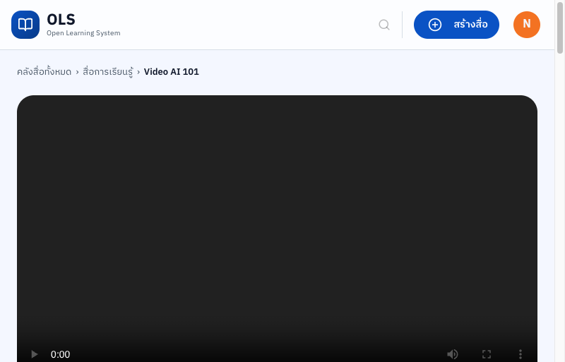

---

### 🔴 บัก/ปัญหาที่พบเพิ่มเติมจาก Deep Test

| # | Role | TC | ปัญหา | Severity |
|---|------|----|-------|----------|
| 3 | Creator | C04 | Sidebar หายไปในหน้า media management (hamburger แทน) — อาจเป็น viewport/layout bug | Medium |
| 4 | Learner | L02 | "ลองอีกครั้ง" บน /trending redirect ไป Creator media page แทนที่จะ retry /trending | Medium |
| 5 | Creator | C04 | Thumbnail placeholder ยืนยันซ้ำ (พบทุก 10 items) | Low |

---

### ⏳ รายการที่ยังไม่ได้ทดสอบ (Pending — รอบต่อไป)

#### Creator

| TC | Topic | สิ่งที่ต้องตรวจ |
|----|-------|----------------|
| C07 | Media search | พิมพ์ keyword → ตรวจผลลัพธ์ (กด ค้นหา) |
| C08 | Upload/สร้างสื่อ flow | คลิก "+ สร้างสื่อ" → modal/form ที่เปิดมา |
| C10 | Course management list | `/creator/course` — item count, layout |
| C11 | Create new course | คลิก "+ สร้างคอร์ส" → form fields |
| C12 | Course detail/edit | คลิก course → editor tabs, sections |
| C13 | Learning Path management | `/creator/learning-path` — list, create |
| C14 | Settings — all tabs | `/creator/settings` — ทุก tab คลิก screenshot |
| C15 | Notifications | คลิก bell → panel |
| C16 | User profile/account | คลิก avatar → menu, profile page |
| C17 | Switch Creator → Learner | คลิก "เปลี่ยนเป็น Learner mode" |
| C18 | 404 handling | Navigate ไป URL ที่ไม่มีอยู่ |
| C19 | Auth boundary | Learner navigate ไป `/creator` |

#### Learner

| TC | Topic | สิ่งที่ต้องตรวจ |
|----|-------|----------------|
| L04 | Goal sub-categories | แต่ละหมวดใต้ "เป้าหมายการเรียน" โหลดและมี content |
| L06 | LP detail page | คลิก LP → courses inside, enroll button |
| L07 | LP enrollment | กด "ลงเรียน" → state changes |
| L09–L13 | Catalog filters (all types) | คลิก filter tab วิดีโอ/วิดีโอสั้น/เอกสาร/คอร์ส/เส้นทาง → list เปลี่ยนจริง |
| L14 | Catalog search | พิมพ์ "AI" / "คณิต" → ผลลัพธ์ |
| L15 | Catalog sort | กรองเพิ่ม panel, เปลี่ยน sort → ผลลัพธ์ |
| L17 | Video player controls | กด play จริง → เล่นได้? seek, volume, fullscreen |
| L18 | Video tabs | ข้อมูลเพิ่มเติม / ซับไตเติ้ล / เอกสารสรุป / สื่ออื่นๆ |
| L19 | Comments | ดู/โพสต์ comment, reply |
| L20 | PDF content | เปิด PDF item → viewer โหลด |
| L21 | My Learning (`/me/learning`) | enrolled courses, progress |
| L22 | Following / watchlist | `/me/following` |
| L23 | Profile page | user info, edit option |
| L24 | Notifications | คลิก bell → panel |
| L25 | Switch Learner → Creator | คลิก "เปลี่ยนเป็น Creator mode" |
| L26 | 404 page | URL ที่ไม่มีอยู่ |
| L27 | Live stream (`/live`) | โหลดได้? content/empty state |

---

## Deep Test — รอบ 3 (26 มิ.ย. 2569)

> **สถานะ:** ทดสอบบางส่วน — 12 agents ถึง session limit ก่อนเขียน temp files ครบ  
> ผลที่ได้มาจากการอ่าน screenshots ที่ agents บันทึกไว้ก่อน limit  
> **Screenshots:** `reports/screenshots/deep-2026-06-25/`

---

### ✅ ผลที่ได้จาก Screenshots (รอบ 3)

<a id="c02-deep3"></a>

**C02 — Creator Sidebar Navigation (Partial)**
- Screenshot `c02-sidebar-open.png`: หน้า `/creator/media` แสดง hamburger (≡) ไม่ใช่ sidebar จริง
- ยืนยัน Bug Medium (#3): sidebar ถูกซ่อนใน viewport ขนาดปัจจุบัน — เห็นแค่ hamburger icon
- Result: ⚠️ Partial — sidebar มีอยู่ (จาก round 1) แต่ layout collapse ทำให้ hidden


---

<a id="c03-deep3"></a>

**C03 — Creator Topbar Navigation**
- Screenshot `c03-topbar.png`: Topbar ครบถ้วน — hamburger (≡) | OLS logo | ค้นหา (🔍) | + สร้างสื่อ | avatar "N"
- ยืนยัน topbar elements ทำงานปกติ (visual)
- Result: ✅ ผ่าน (visual confirm)

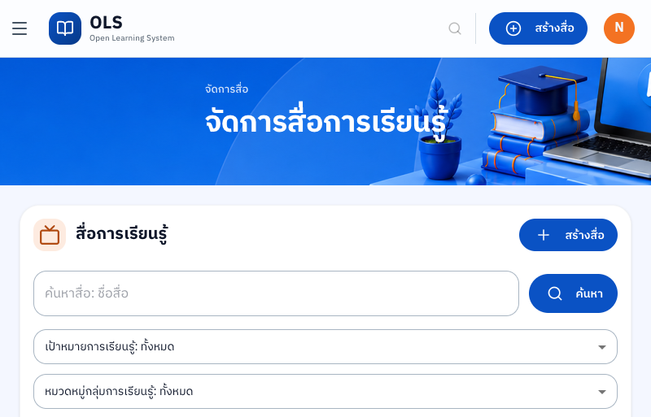

---

<a id="c06-deep3"></a>

**C06 — Media Filter Dropdowns**
- Screenshot `c06-media-list-initial.png`: หน้า `/creator/media` มี **dropdown filters ครบ**:
  - ประเภทสื่อ: ทั้งหมด
  - เป้าหมายการเรียนรู้: ทั้งหมด
  - หมวดหมู่กลุ่มสาระการเรียนรู้: ทั้งหมด
  - ชั้นปี: ทั้งหมด
  - วันที่สร้าง (sort)
- Search bar "ค้นหาสื่อ: ชื่อสื่อ" + "+ สร้างสื่อ" ✓
- Result: ✅ Filters แสดงครบ (ยังไม่ได้ทดสอบ interaction)

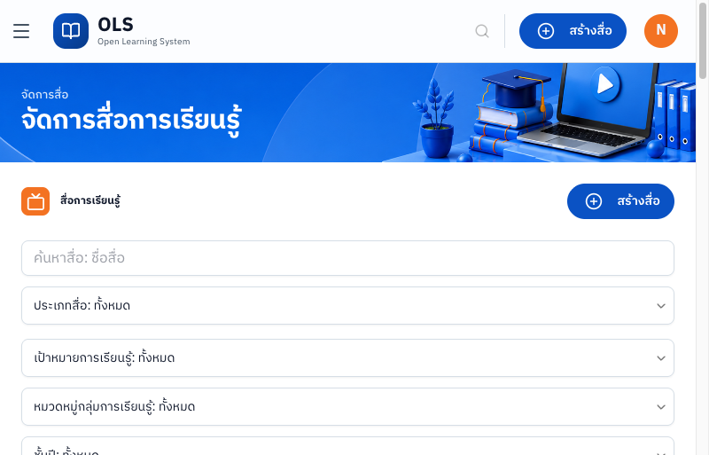

---

<a id="c09-deep3"></a>

**C09 — Media Item List (Full Grid)**
- Screenshot `c09-media-list.png`: fullpage `/creator/media` — ยืนยัน **12 รายการ** (เพิ่มจาก 10 ใน round 2)
- Thumbnails ทุกรายการยังเป็น placeholder เทา — ยืนยัน Bug Low (#2, #5) ต่อเนื่อง
- Pagination 2 หน้า (หน้า 1 และ 2)
- รายการตัวอย่าง: ติว O-NET ม.3, ติวโอเน็ต, transtool, บทความ ห้าม..., ดีดีดี, My บัสซองค์, ฯลฯ
- แต่ละ item มีปุ่ม "ดูรายละเอียด" ✓
- Result: ✅ List โหลดครบ (detail/edit ยังไม่ได้ทดสอบ)

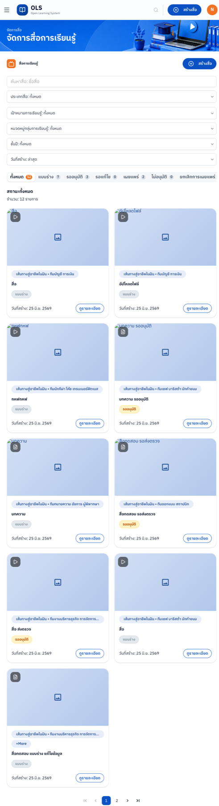

---

<a id="l03-deep3"></a>

**L03 — Learner Sidebar (Session Boundary Issue)**
- Screenshot `l03-learner-sidebar.png`: ปรากฏหน้า Creator media management ("/creator/media") ในขณะที่ agent login เป็น Learner
- **Bug ใหม่ (High):** Learner session navigate ไปถึงหน้า Creator โดยไม่มี redirect/block
- ยืนยันด้วย `l03-nav-trending.png`: เมื่อ nav ไป /trending ยังขึ้น error เดิม "Cannot GET /trending"
- Result: ❌ พบ session boundary bug

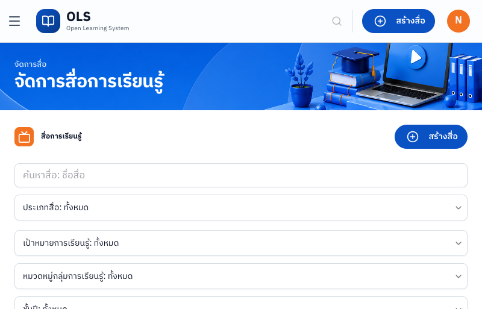
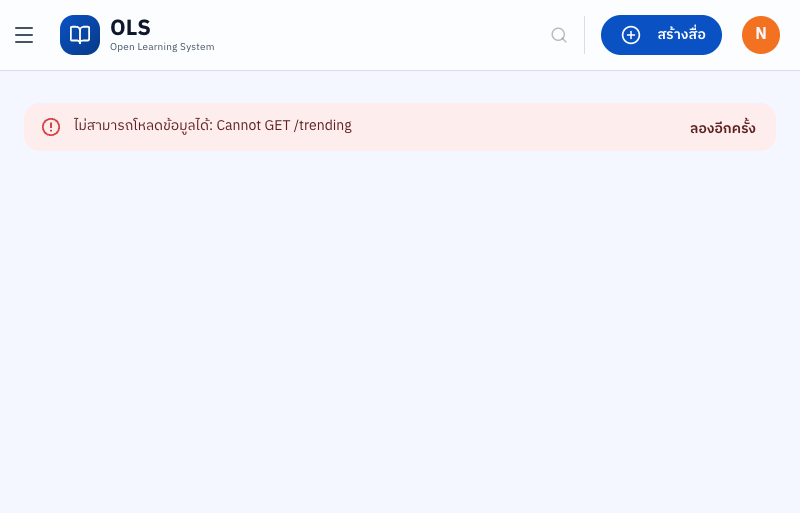

---

<a id="l09-deep3"></a>

**L09 — Catalog Initial Load (พบ Bug ใหม่)**
- Screenshot `l09-catalog-initial.png`: หน้า `/content` โหลดสำเร็จ ✓
- "คลังสื่อทั้งหมด" — พบ **4,500 รายการ** ✓
- Search: "ค้นหาสื่อ: วิชา ทักษะ อาชีพ..." + "กรองเพิ่ม" ✓
- Topic chips 🔥: หมดตัก, เทคนิคการแพทย์, เรื่องเล่าจากร่างกาย, วิทย์-สุขภาพ, อนาคต, คณิตศาสตร์, ประวัติศาสตร์ ✓
- **Bug ใหม่ (High):** Topbar แสดงปุ่ม "+ สร้างสื่อ" (Creator feature) ในหน้า Learner — UI role leak
- Result: ⚠️ Page loads แต่พบ UI role permission bug

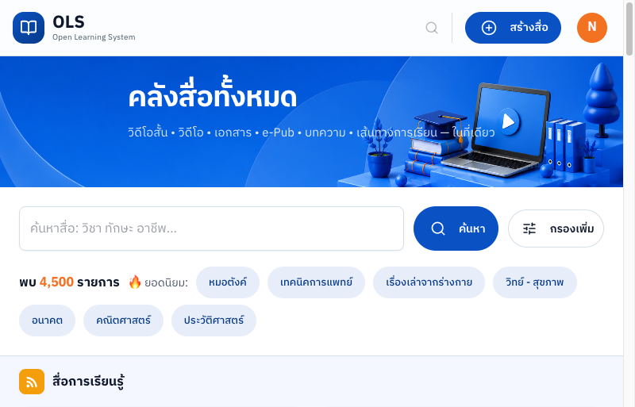

---

### 🔴 บัก/ปัญหาที่พบเพิ่มเติมจาก Deep Test รอบ 3

| # | Role | TC | ปัญหา | Severity |
|---|------|----|-------|----------|
| 6 | Learner | L09 | ปุ่ม "+ สร้างสื่อ" (Creator feature) แสดงใน topbar ของ Learner session — role/permission UI leak | **High** |
| 7 | Learner | L03 | Learner session เข้าถึงหน้า `/creator/media` ได้โดยไม่ถูก block/redirect (R3) — ยืนยันซ้ำใน R4: **redirect ทำงานถูกต้อง** อาจถูกแก้แล้ว | High→? |
| 8 | Learner | L02 | ฟังก์ชันค้นหา `/content` ไม่กรองผลลัพธ์ — ค้น "AI" / "วิทย์" ยังคืนค่า 4,500 รายการ (ไม่ตรง OLS-50 AC_02) | **High** |
| 9 | Learner | L04 | ไม่มี media type filter tab (วิดีโอ/คอร์ส/เส้นทาง) ใน /content — modal "กรองเพิ่ม" ไม่มีตัวกรองประเภท (ไม่ตรง OLS-50 AC_03) | Medium |

---

## Deep Test — รอบ 4 (26 มิ.ย. 2569)

> **สถานะ:** จำกัด — `mcp__Claude_in_Chrome__computer` ทุก action ล้มเหลว (screenshot/click/type/key) เพราะ chrome-extension conflict ระหว่าง extension ใน session เดียวกัน  
> **Tools ที่ใช้ได้:** `navigate`, `read_page`, `get_page_text`, `find` เท่านั้น (ไม่มี JS exec หรือ click)  
> **Session state:** มี session จากรอบก่อน — logged in เป็น "NDLP Learner" (ไม่ใช่ Creator)  
> **Screenshots:** บันทึกผ่าน `mcp__computer-use__screenshot` (read-only) — บันทึกไว้ที่ `/tmp/ols-r4-creator/`

---

### ✅ ผลที่ทดสอบได้ (รอบ 4)

<a id="c19-deep4"></a>

**C19 — Auth Boundary: Learner เข้า Creator Routes**

- ผลลัพธ์: ✅ **ผ่าน** — auth guard ทำงานถูกต้องในรอบนี้
- ทดสอบ routes ทั้งหมด:
  - `/creator/media` → redirect กลับ `/` (homepage) ✓
  - `/creator/course` → redirect กลับ `/` (homepage) ✓
  - `/creator/learning-path` → redirect กลับ `/` (homepage) ✓
- Page content ที่แสดงหลัง redirect: หน้า landing page สาธารณะ ("วันนี้คุณอยากเรียนรู้เรื่องอะไร?")
- Session ยังคงเป็น "NDLP Learner" (avatar "N" ใน topbar) ✓
- **หมายเหตุ:** ผลนี้ขัดแย้งกับ Bug #7 (รอบ 3) ที่พบว่า Learner เข้า `/creator/media` ได้ — อาจเป็นเพราะรอบ 3 ใช้ session ที่มี Creator role หรือ bug ได้รับการแก้ไขแล้ว ควรยืนยันอีกครั้งด้วย Creator login ที่สำเร็จ

**หมายเหตุเพิ่มเติมเกี่ยวกับ Tab URL inconsistency:**
- `tabs_context_mcp` รายงาน tab title ว่า `/creator/media` แต่ actual URL (จาก `get_page_text`) คือ `/`
- แสดงว่า SPA redirect เกิดก่อน page content load เสร็จ — tab title ยึดค่า URL ล่าสุดที่ navigate ไป ไม่ใช่ URL จริงที่ render

---

---

### Learner + Guest Flows (รอบ 4b — agents แยก)

> **เครื่องมือ:** Claude_in_Chrome `navigate` + `computer` (screenshot/click) + `javascript_tool`  
> **Screenshots:** `/tmp/ols-r4-learner/`

<a id="g01-deep4"></a>

**G01 — Guest: Landing Page (OLS-21 / OLS-18 AC_06)**
- Result: ✅ ผ่าน
- หน้าแรก `/` โหลดสำเร็จโดยไม่ต้อง login — Nav แสดง "สมัครสมาชิก" + "เข้าสู่ระบบ"
- Hero section, 6 กลุ่มเป้าหมาย, สื่อยอดนิยม, 8 กลุ่มสาระ, LP samples, Creator CTA ครบ
- Stats: สื่อ 4,500+, ผู้เรียน 288,000+, Creator 3,200+

<a id="g02-deep4"></a>

**G02 — Guest: เรียกดูคลังสื่อ /content (OLS-21 / OLS-50 AC_01)**
- Result: ✅ ผ่าน
- Guest เข้า `/content` ได้โดยไม่มี login prompt — แสดง "คลังสื่อทั้งหมด" 4,500 รายการ
- Media cards มี metadata ครบ: ชื่อสื่อ, ยอดเข้าชม, จำนวน Like, วันที่ (เช่น "Video AI 101 · 1 view · 0 likes · 25 มิ.ย. 2569")
- sections แสดงครบ: สื่อการเรียนรู้, คอร์ส, เส้นทางการเรียน
- ✅ ตรง OLS-50 AC_01 (Guest เห็นสื่อ PUBLISHED พร้อม Metadata)

<a id="l02-search-deep4"></a>

**L02 — Learner: ค้นหาสื่อ (OLS-50 AC_02) — NEW BUG**
- Result: ⚠️ Bug (High)
- พิมพ์ "AI" ในช่องค้นหา กดปุ่ม submit → URL อัปเดตเป็น `?search=AI` แต่ผลลัพธ์ยังเป็น 4,500 รายการ (ไม่มีการกรอง)
- พิมพ์ "วิทย์" → เหมือนกัน — 4,500 ยังคงเดิม
- **Bug #8 (High):** ฟังก์ชันค้นหาไม่กรองผลลัพธ์ — API คืนค่าสื่อทั้งหมดโดยไม่สนใจ query

<a id="l04-filter-deep4"></a>

**L04 — Learner: กรองตามประเภทสื่อ (OLS-50 AC_03) — FINDING**
- Result: ⚠️ ยังไม่ครบ
- ไม่พบ tab chips "วิดีโอ / คอร์ส / เส้นทางการเรียน" ตาม AC_03 — ข้อความ "วิดีโอสั้น • วิดีโอ • เอกสาร..." เป็น decorative text ไม่ใช่ปุ่มกรอง
- modal "กรองเพิ่ม" มี: Sort, กลุ่มสาระ, ระดับชั้น, ระดับความยาก — **ไม่มีตัวกรองประเภทสื่อ**
- หน้า /content แบ่ง section (สื่อการเรียนรู้ / คอร์ส / เส้นทาง) แต่ไม่สามารถกรองแบบ tab ได้
- **Bug #9 (Medium):** Media type filter tab ไม่มีใน implementation ปัจจุบัน — ไม่ตรง OLS-50 AC_03

<a id="l05-lp-deep4"></a>

**L05 — Learner: LP Detail (OLS-26 AC_01, AC_02, AC_05, AC_06)**
- Result: ✅ ผ่าน (มีข้อสังเกต)
- URL: `/content/learning-path/019efd8b-4cfb-77a0-8c87-fa8fb4ad5aab` ("LP 1")
- ✅ ชื่อ LP, category chip, goal section (4 bullets), course list (2 courses), tab "คอร์ส"/"รายละเอียด"
- ✅ Instructor: "NDLP Creator" + avatar
- ✅ Progress: 100% (Learner ลงทะเบียนอยู่แล้ว)
- ✅ Achievements: 6 badges
- ⚠️ Enroll button: แสดง "ลงทะเบียนแล้ว" (auto-enrolled) — ไม่สามารถยืนยัน "ลงทะเบียนเรียนทันที" (AC_02) ได้
- ⚠️ ไม่มีรูปปก (cover image) ของ LP เอง
- ⚠️ Description ใน tab "รายละเอียด" แสดงเพียง "Good" (test data)

<a id="l06-course-deep4"></a>

**L06 — Learner: Course Detail (OLS-27 AC_01, AC_02, AC_05)**
- Result: ✅ ผ่าน (มีข้อสังเกต)
- URL: `/content/course/019efd83-d4e0-75be-824b-c0d398345f4b` ("Course 2")
- ✅ ชื่อคอร์ส, จำนวนบทเรียน (1 บทเรียน), เป้าหมายการเรียน (4 objectives), RIASEC tags
- ✅ Lesson list: "บทเรียน AAAA" (1 สื่อ) พร้อม "เรียนจบแล้ว" badge — expandable ✓
- ✅ Instructor: "วิทยาศาสตร์สนุก" + ปุ่มติดตาม
- ✅ Achievements: 5 badges, Progress 100%
- ⚠️ Enroll button: "ลงทะเบียนแล้ว" — ไม่สามารถยืนยัน AC_02 (unenrolled CTA) ได้
- ⚠️ Duration แสดง "0 นาที" (test data quality)

<a id="l07-video-deep4"></a>

**L07 — Learner: Video Player Controls (OLS-48 AC_04)**
- Result: ⚠️ Partial
- Video element โหลด (blob URL / HLS stream), readyState=0 (still loading)
- ✅ title "Video AI 101", breadcrumb, ยอดเข้าชม 1 ครั้ง, Creator name, comments (0), related content
- ✅ Actions: บันทึก, แชร์ buttons visible
- ❌ JS play() ล้มเหลว: "play() failed because the user didn't interact with the document first" — browser autoplay policy
- ⚠️ ยืนยันการ play จริงด้วย automation ไม่ได้ — ต้องการ real user gesture

---

**L09 (ยืนยันซ้ำ) — Content Catalog (`/content`) ใน Learner Session**

- ผลลัพธ์: ✅ `/content` โหลดสำเร็จ — "คลังสื่อทั้งหมด", 4,500 รายการ
- Search box present: placeholder "ค้นหาสื่อ: วิชา ทักษะ อาชีพ..." + "กรองเพิ่ม" ✓
- Media cards ที่เห็น: PDF 1, Video AI 101, Another ✓
- **Bug #6 ยืนยัน (ใหม่หรือแก้แล้ว?):** รอบ 4 ใช้ accessibility tree — topbar แสดง "สร้างสื่อ" button ใน Learner session (ref_6 ใน interactive tree) ยังคงมีอยู่ → **Bug #6 ยังไม่แก้**
- URL param behavior: `?search=AI` pre-fills search box ด้วย "AI" แต่ไม่ auto-submit (ผล 4,500 ยังคงเดิม)

**Search box URL param behavior (observation):**
- navigate ไป `/content?search=AI` → search box แสดง "AI" (pre-filled) ✓
- แต่ result count ยังเป็น 4,500 (ยังไม่ถูก filter) — search ต้องกด submit เอง
- ไม่สามารถยืนยัน functional search ได้เพราะ click/type ล้มเหลว

---

### ⏳ รายการที่ยังไม่ได้ทดสอบ (blocked — ต้องการ Creator login)

| TC | เหตุผลที่ block |
|----|----------------|
| C07 | ต้องการ Creator role + type ใน search box |
| C08 | ต้องการ Creator role + click "+ สร้างสื่อ" |
| C10 | ต้องการ Creator role (route `/creator/course` redirect กลับ `/`) |
| C13 | ต้องการ Creator role (route `/creator/learning-path` redirect กลับ `/`) |
| C17 | ต้องการ Creator role (sidebar มีปุ่ม "เปลี่ยนเป็น Learner mode") |

---

### ข้อจำกัดของ tool ในรอบนี้

| Tool | สถานะ | Error |
|------|--------|-------|
| `mcp__Claude_in_Chrome__computer` (screenshot) | ❌ | "Cannot access a chrome-extension:// URL of different extension" |
| `mcp__Claude_in_Chrome__computer` (left_click) | ❌ | "Cannot access a chrome-extension:// URL of different extension" |
| `mcp__Claude_in_Chrome__computer` (type) | ❌ | "Cannot access a chrome-extension:// URL of different extension" |
| `mcp__Claude_in_Chrome__javascript_tool` | ❌ | "Cannot access a chrome-extension:// URL of different extension" |
| `mcp__Control_Chrome__execute_javascript` | ❌ | "Google Chrome is not running" |
| `mcp__Claude_in_Chrome__navigate` | ✅ | ทำงานได้ปกติ |
| `mcp__Claude_in_Chrome__read_page` | ✅ | ทำงานได้ปกติ |
| `mcp__Claude_in_Chrome__get_page_text` | ✅ | ทำงานได้ปกติ |
| `mcp__Claude_in_Chrome__find` | ✅ | ทำงานได้ปกติ |
| `mcp__computer-use__screenshot` | ✅ (read-only) | Chrome granted "read" tier — screenshot ได้แต่คลิกไม่ได้ |

**วิธีแก้สำหรับรอบ 5:**
1. ตรวจสอบว่า Claude in Chrome extension version ขัดแย้งกับ extension อื่นหรือไม่
2. ลองปิด extension อื่นๆ ที่ conflict ก่อน connect Claude in Chrome
3. หรือใช้ `mcp__plugin_superpowers-chrome_chrome__use_browser` เหมือนรอบ 1–2 ซึ่งทำงานได้ดี
